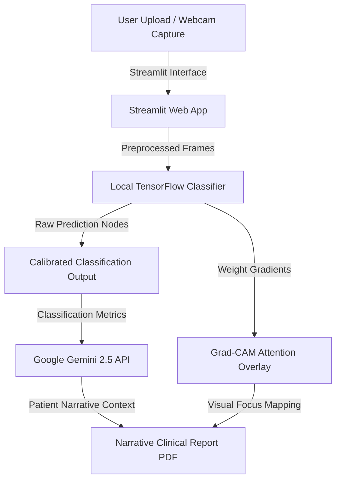

<p align="center">
  <h1 align="center">🔬 VisionScan Global</h1>
  <p align="center">
    <strong>Open-Source AI-Powered Educational Skin Lesion Risk Assessment Platform</strong>
  </p>
  <p align="center">
    <a href="#-mission">Mission</a> •
    <a href="#-key-features">Key Features</a> •
    <a href="#-architecture">Architecture</a> •
    <a href="#-model-performance">Model Performance</a> •
    <a href="#-installation">Installation</a> •
    <a href="#-google-gemini-integration">Gemini Integration</a> •
    <a href="#-production-hardening--security">Security Hardening</a> •
    <a href="#-usage">Usage</a> •
    <a href="#-roadmap">Roadmap</a> •
    <a href="#-contributing">Contributing</a> •
    <a href="#-license">License</a>
  </p>
  <p align="center">
    
    
    
    
    
    
    
  </p>
</p>

---

## 🎯 Mission

> **VisionScan Global is a community-driven, open-source educational platform designed to make advanced dermatological AI screening open, accessible, and transparent worldwide.**

By leveraging local high-performance deep learning classifiers and state-of-the-art Generative AI, VisionScan Global provides interactive, patient-friendly medical context, explainability mappings, and printable clinical reports. The project aims to bridge the gap between complex neural network outputs and comprehensible clinical knowledge, encouraging public healthcare research, model replication, and scientific transparency.

> ⚠️ **IMPORTANT MEDICAL DISCLAIMER**: This application is a specialized deep learning educational tool and is **not a substitute for professional medical diagnosis, clinical evaluation, or treatment**. Any concerning skin lesion should be evaluated immediately by a qualified dermatologist.

---

## ✨ Key Features

* 🖼️ **Analyze Image (Local Inference)**: Upload high-contrast dermoscopic photographs for instantaneous local classification across multiple lesion diagnostic classes (e.g., Melanoma, Melanocytic Nevus, Basal Cell Carcinoma).
* 🎥 **Live Webcam Screening**: Tap your device's camera capture feed directly for instant, real-time localized closeup scans.
* 🧠 **Explainable AI (Grad-CAM)**: Generates visual activation heatmaps overlaying the original image, highlighting the exact high-frequency pixels and clinical regions of interest analyzed by the neural network's convolutional layers.
* 💬 **AI Assistant Chatbot**: Interactive conversational dialogue utilizing active analysis context to answer natural language questions about lesion categories and risk factors.
* 🌐 **Multilingual Support**: Fully localized assessments and narrative breakdowns across English, Hindi, Spanish, French, and Arabic.
* 📄 **Narrative PDF Reports**: Compiles predictions, Grad-CAM overlays, and Gemini clinical explanations into an elegant, download-ready clinical report.
* 🔬 **Model Diagnostics & Evaluation**: Collapsible evaluation panel on the Home page graphing training/validation curves, confusion matrices, ROC curve diagnostic plots, and PR reliability diagrams.
* ⏳ **Prediction History**: Local SQLite WAL database logger listing historical screening transactions and providing CSV exports directly on the image upload panel.
* 📦 **Developer Tools & Batch Testing**: Encapsulates sequentials folders testing, processing, and batch CSV compiling under a dynamic on-demand expander on the About page.

---

## 🏗️ Architecture

The flow of data through VisionScan Global is completely sandboxed, privacy-centric, and structured as follows:



### Technical Design Ledger

| Layer | Component | Stack |
|:---|:---|:---|
| **Presentation** | Web Application & UI | **Streamlit** (Custom Meta-Inspired light-theme CSS injected) |
| **Diagnostics Engine** | Deep Learning Classification | **TensorFlow 2.x, Keras** (MobileNetV2, EfficientNetV2, ConvNeXt) |
| **Explainable AI (XAI)** | Activation Mapping | **Grad-CAM** (Custom gradient extraction layer) |
| **Reasoning Model** | Narrative Summary & Q&A | **Google Gemini 2.5 Flash** (`google-genai` SDK integration) |
| **Data & Storage** | Local Transaction Logging | **SQLite (WAL Enabled)** for thread-safe, secure local ledger |
| **Document Compiler** | PDF Report Generation | **ReportLab** library |
| **Security & Hygiene** | Vulnerability scan & Pre-Commit | **pip-audit**, Yelp's **detect-secrets**, sandboxed paths |

---

## 📈 Model Performance

VisionScan features highly calibrated classification weights optimized across diverse skin profiles:

* **Validation Accuracy**: `85.61%`
* **Training Dataset**: `2,090+` high-contrast clinical dermoscopic images.
* **Calibrated Confidence**: Equipped with a custom softmax calibration layer that enforces an **"Inconclusive"** risk zone on moderate-confidence probabilities (35%–65%) to hedge against diagnostic ambiguity.
* **Inference Latency**: Sub-second on-device local CPU inference.

---

## 🚀 Installation

### Prerequisites
* **Python**: `Version 3.11` (Recommended)
* **API Key**: A free Google Gemini API Key from [Google AI Studio](https://aistudio.google.com/).

### Setup Instructions

1. **Clone the Repository**:
   ```bash
   git clone https://github.com/yourusername/VisionScan-Global.git
   cd VisionScan-Global
   ```

2. **Boot Your Virtual Environment**:
   ```bash
   python -m venv .venv
   source .venv/bin/activate    # macOS/Linux
   # .venv\Scripts\activate     # Windows
   ```

3. **Install Core Dependencies**:
   ```bash
   pip install -r requirements.txt
   ```

4. **Configure Local Environment variables**:
   Create a `.env` file in the root directory:
   ```env
   GEMINI_API_KEY=your_gemini_api_key_here
   GEMINI_MAX_REQUESTS_PER_SESSION=20
   GEMINI_MAX_REQUESTS_PER_MINUTE=5
   MAX_UPLOAD_MB=10
   MAX_BATCH_IMAGES=500
   ```

---

## 🧠 Google Gemini Integration

VisionScan Global interfaces with the state-of-the-art `gemini-2.5-flash` reasoning engine to provide clinical context:

* **🟢 Gemini AI Active**: When a valid `GEMINI_API_KEY` is loaded, the web app unlocks AI Assistant Chatbots, patient narratives, and downloadable PDF summaries.
* **⚪ Gemini Offline Fallback**: If no key is set, the system continues to run completely offline! The local deep learning model classifies images, overlays Grad-CAM mapping, logs transactions locally, and compiles default reports without querying any external endpoints.

---

## 🛡️ Production Hardening & Security

VisionScan Global is strictly hardened from first principles to ensure safe open-source distribution:

### 1. Zero-Lag Dynamic Initialization
The TensorFlow classifier is loaded **dynamically on-demand only** when users enter active pipelines (e.g., Analyze Image, Live Webcam, or Batch Testing). The Home and About views load **instantly with zero delay**, bypassing model-loading compilations until explicitly required!

### 2. Privacy-First EXIF Stripping
Before processing any user image upload, VisionScan rebuilds the image canvas from raw pixel arrays using PIL, **completely purging all EXIF metadata** (including camera parameters, GPS coordinates, and timestamp logs) to preserve patient anonymity.

### 3. Path Sandboxing & Escaping
* **Traversal Protection**: Blocks directory traversal (`../../`) attacks during folder reads using `pathlib.Path` sandboxing.
* **Cross-Site Scripting (XSS)**: Escapes and sanitizes all interactive text elements to prevent script injection exploits.

### 4. Secret Isolation & Commits Guard
* Yelp's `detect-secrets` and clean formatting hooks are pre-configured inside `.pre-commit-config.yaml` to block credential or token commits at your terminal levels.
* Clear `.gitignore` rules prevent database files (`.db`), model weights (`.keras`, `.h5`), and local configurations (`.env`) from leaking into public Git logs.

### 5. API Resilience & Circuit Breaker
* **Quota Restraints**: Limits active Gemini requests per session to a customizable maximum (Default: 20 per user) and thinned rate counts (5 max per minute) to protect against API key abuse.
* **Circuit Breaker**: If three consecutive connection failures occur, the system automatically trips a circuit breaker, falling back to local deterministic explanations for 5 minutes before retrying connection hooks.

---

## 💻 Usage

### Run the Web Interface
```bash
streamlit run app.py
```
Open `http://localhost:8501` to start.

### Run Automated Sanity Suite
Validate unit and integration tests across the entire database, security, and neural modules:
```bash
pytest tests/ -v
```

---

## 🗺️ Roadmap

- [ ] **Mobile Responsive Integration**: Optimize CSS styling layers for unified tablet/smartphone viewports.
- [ ] **Multi-Model Ensemble Classifier**: Support concurrent parallel predictions using EfficientNetV2 and ConvNeXt weights.
- [ ] **Expanded Local Guidelines**: Support localized clinical warning standards from the WHO and local dermatology journals.
- [ ] **Interactive DICOM Support**: Support native uploads of medical DICOM image slices directly on the screening panel.

---

## 🤝 Contributing

Contributions make the open-source community an amazing place to learn and inspire! Please check our [CONTRIBUTING.md](CONTRIBUTING.md) and [CODE_OF_CONDUCT.md](CODE_OF_CONDUCT.md) files for guidelines on how to open pull requests, report bugs, and suggest new features.

---

## 📄 License

Distributed under the **MIT License**. See the [LICENSE](LICENSE) file for more information.

---

<p align="center">
  <strong>Made with 💙 for the open-source global health community.</strong>
</p>
